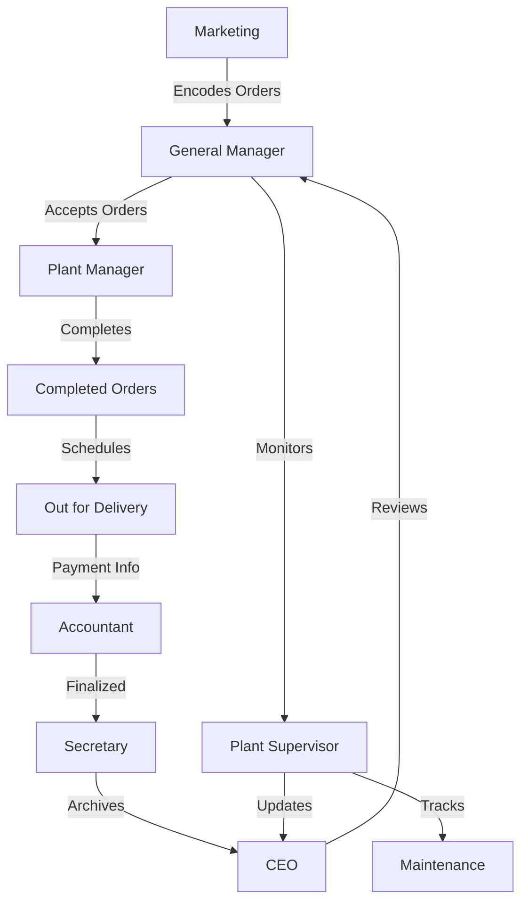

Here’s the workflow, arranged based on the order of operations and responsibilities, emphasizing the flow of work from one role to another:

### **1. Marketing (First Step)**
- **Function 1**: Encode Purchase Order
  - Marketing encodes new orders based on customer requests, including details like customer name, product type (Plain, Lithograph, Class C), and quantity.
  
- **Function 2**: Manage Customer Data
  - Marketing updates or manages customer contact information and order history.

---

### **2. General Manager**
- **Function 1**: View Order Details
  - The General Manager views new purchase orders submitted by Marketing.
  
- **Function 2**: Accept Order
  - Based on product availability and capacity, the General Manager accepts or rejects the order.
  
- **Function 3**: View Production Analytics
  - The General Manager assesses production capacity and efficiency to ensure orders can be fulfilled.

- **Function 4**: Track Maintenance
  - The General Manager ensures that machinery maintenance schedules align with production needs.

---

### **3. Plant Manager**
- **Function 1**: View Order Details
  - After the General Manager accepts the order, the Plant Manager views the order details (customer, type, quantity).
  
- **Function 2**: Mark Orders as Completed
  - The Plant Manager marks orders as completed after production is finished.
  
- **Function 3**: Schedule Delivery
  - The Plant Manager coordinates with production and logistics to schedule delivery for completed orders.
  
- **Function 4**: Monitor Out for Delivery Orders
  - The Plant Manager can view and track orders that are currently out for delivery.

---

### **4. Plant Supervisor**
- **Function 1**: Track Maintenance
  - The Plant Supervisor monitors equipment maintenance to ensure smooth production, and addresses maintenance alerts as they arise.
  
- **Function 2**: View Production Analytics
  - The Plant Supervisor oversees the daily production metrics and efficiency rates to ensure the factory meets its production goals.

---

### **5. Accountant**
- **Function**: Track Payment
  - Once an order is marked as "Out for Delivery", the Accountant can start tracking the payment.

---

### **6. Secretary**
- **Function**: View Archive
  - After the order is completed and paid for, the Secretary manages the archiving of records, including:
    - Completed purchase orders
    - Delivery records
    - Maintenance logs

---

### **7. CEO (Final Step)**
- **Function**: View Overall Analytics
  - The CEO reviews an overall report of company performance, including:
    - Sales data (from orders)
    - Production efficiency (from production analytics)
    - Financial status (from payments)
    - Delivery performance (from scheduled deliveries)

---

### **Work-Based Workflow Overview**

### **Key Flow Points**:
1. **Marketing** initiates the workflow by encoding the purchase order.
2. **General Manager** accepts the order and manages high-level decisions.
3. **Plant Manager** handles order completion, delivery scheduling, and monitors out-for-delivery orders.
4. **Plant Supervisor** tracks production efficiency and maintenance.
5. **Accountant** tracks payments for orders that are out for delivery.
6. **Secretary** archives the completed orders and logs.
7. **CEO** reviews overall analytics, providing strategic insight.

This updated structure highlights the new "Out for Delivery" status and the Plant Manager's role in monitoring these orders.
